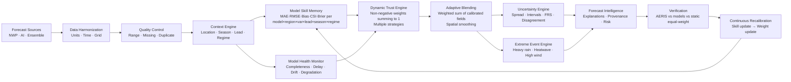

# AERIS Architecture

## Core principle

Every dashboard surface consumes a single central intelligence engine:  
**Context-Aware Forecast Trust Engine**

Nothing in AERIS is disconnected. Model health, regime detection, skill memory, uncertainty, and extreme events all feed into — or derive from — the trust engine.

## Pipeline

## Layers

| Layer | Package / Module | Responsibility |
|---|---|---|
| Canonical types | `packages/schemas/aeris_schemas` | `ForecastModelAdapter`, `Variable`, `RegimeClass`, `WeightingStrategy`, etc. |
| Shared numerics | `packages/shared/aeris_shared` | `normalize_weights`, `mae`, `rmse`, `brier`, `gaussian_smooth`, etc. |
| Ingestion | `services/ingestion` | `BaseForecastAdapter`, mock adapters, `harmonize()`, `convert_units()` |
| Regime | `services/regime` | `RegimeDetector` (KMeans + rule overlay), `RegimeTransitionDetector`, `season_from_month` |
| Model health | `services/model_health` | `ModelHealthEngine` → `HealthReport` → weight adjustment |
| Blending | `services/blending` | `DynamicTrustEngine`, `TrustInput/Output`, `FRSComponents`, `ForecastFailureRiskEngine`, `run_counterfactual`, `smooth_weight_fields` |
| Verification | `services/verification` | `compute_skill`, `reliability_diagram`, `skill_score_composite` |
| Extreme events | `services/extreme_events` | `detect_events`, `WeatherEvent` dataclass |
| Pipeline | `apps/api/app/pipeline.py` | Orchestrates seed, blend, skill, health, verification, learning loop |
| API | `apps/api/app/routers.py` | FastAPI routes, WebSocket, OpenAPI |
| Frontend | `apps/web/src` | Next.js 15, 15 pages, MapLibre, Recharts |

## Weighting strategies

| Strategy | Mechanism |
|---|---|
| `SKILL_WEIGHTED` | Inverse MAE per model, normalized |
| `CONTEXTUAL_ML` | Heuristic context prior (demo); replaced by XGBoost/LightGBM meta-model when operational data exists |
| `BAYESIAN_AVERAGE` | Inverse variance (1/RMSE²), normalized |
| `OPTIMIZATION` | Inverse-error simplex proxy |
| `EVENT_SPECIFIC` | Context + CSI bonus for event-detection performance |

All strategies guarantee: **w_i ≥ 0** and **Σ w_i = 1**. NaN and negative values are rejected by `normalize_weights`.

## Spatial coherence

Weight fields are smoothed with `gaussian_smooth` using a k-nearest-neighbour graph (k=4).  
Smoothing levels: OFF / LOW (0.15) / MEDIUM (0.35) / HIGH (0.60).  
Extreme-event signals are preserved because smoothing operates on the weight field before blending, not on the forecast values.

## Counterfactual simulation

`run_counterfactual` creates an independent copy of `TrustInput` with removed/boosted models.  
Production `DynamicWeight` rows are **never modified**. `production_mutated: false` is asserted in tests.

## Database

MySQL for deployments, SQLite for local/demo runs (lat/lon indexes).  
SQLite supported for zero-dependency demo.  
20 tables: see `DATA_MODEL.md`.

## Observability

- Structured JSON logging (every request, latency, request ID)
- `x-request-id` and `x-aeris-data-mode` response headers on every call
- Pipeline job records in `pipeline_runs` table
- System metrics in `system_metrics` table
- MLflow experiment tracking (optional, gracefully skipped if unavailable)
