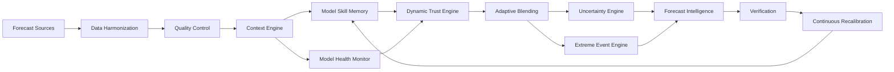

# AERIS Implementation Plan

**Product:** Adaptive Ensemble & Regime Intelligence System  
**Status:** Hackathon prototype (Smart India Hackathon 2026, PS 26081)  
**Principle:** Every dashboard surface consumes the **Context-Aware Forecast Trust Engine**.  
**Honesty:** Demonstration / benchmark data unless operational adapters are configured. No fabricated operational skill, no government endorsement claims.

## Architecture

**Core question:** Which forecast source should be trusted, by how much, where, when, and under what atmospheric conditions?

### Modes

| Mode | Purpose |
|------|---------|
| A — Demonstration | Seeded synthetic ensemble + observations. Offline after install. UI labeled **Demonstration / Benchmark Data**. |
| B — Operational | Same engines; pluggable adapters. No rewrite. |

## Components

| Layer | Package | Responsibility |
|-------|---------|----------------|
| Adapters | `services/ingestion` | `ForecastModelAdapter` + mock NWP/AI/ensemble + real stubs |
| Harmonization | `services/ingestion` | Units, time, grid alignment, QC, bias-correction hooks |
| Context | `services/regime` | Location, season, lead, regime, transition, disagreement |
| Skill memory | `services/verification` | Rolling MAE/RMSE/bias/CSI/Brier by model×region×variable×lead×season×regime |
| Health | `services/model-health` | Completeness, delay, shift, degradation → weight adjustment |
| Trust | `services/blending` | Non-negative weights summing to 1; multiple strategies |
| Blend | `services/blending` | Weighted sum of calibrated fields; redistribute on outage |
| Uncertainty | `services/blending` | Spread, intervals, disagreement ≠ confidence |
| Extremes | `services/extreme-events` | Event objects (rain/heat/wind) |
| GIS | `apps/web` + GeoJSON APIs | India-first MapLibre layers |
| Verification | `services/verification` | AERIS vs models vs static equal-weight |
| Counterfactual | `services/blending` | Simulation-only; never mutates production |
| MLOps | `ml/` + MLflow | Meta-model registry, versions, metrics |
| Jobs | Celery | Skill refresh, blend, learning loop |

## Database entities

MySQL for deployed persistence and SQLite for local/demo runs (lat/lon index on location). See `docs/DATA_MODEL.md`.

- forecast_sources, forecast_runs, forecast_values  
- observations  
- model_skill, model_health  
- weather_regimes, regime_transitions  
- dynamic_weights, blended_forecasts, uncertainty_metrics  
- extreme_events, verification_results  
- forecast_explanations, forecast_provenance  
- simulation_runs, ml_models, pipeline_runs, alerts, system_metrics  

## APIs

Versioned `/api/v1/*` (OpenAPI). Key routes: health, models, forecast, blend, weights, reliability, disagreement, extremes, regimes, verification, model-health, counterfactual simulations, provenance. WebSockets for forecast/health/event/pipeline updates.

## ML pipeline

1. Build feature table: context + recent errors per model.  
2. Train LightGBM/XGBoost meta-model to predict reliability (or inverted error).  
3. Normalize scores → weights (`w_i ≥ 0`, `Σ w_i = 1`, no NaN).  
4. Fallback: skill-weighted / Bayesian-inspired / optimization / event-specific.  
5. Log to MLflow. SHAP optional for “Why this forecast?”.  
6. Continuous learning: update rolling skill first; retrain meta-model on schedule, not every observation.

## Dependencies (implementation-time stable)

- **Web:** Next.js, React, TypeScript, Tailwind, shadcn/ui, Lucide, MapLibre GL, Recharts, TanStack Query, Zod, RHF  
- **API:** FastAPI, Pydantic v2, SQLAlchemy 2, Redis, Celery  
- **Science:** NumPy, pandas, xarray, SciPy, scikit-learn, XGBoost, LightGBM, Optuna (hooks), statsmodels, netCDF4, zarr  
- **Ops:** Docker Compose, PostgreSQL, Redis, MLflow, GitHub Actions  

## Milestones (build order)

| Phase | Scope | Done when |
|-------|--------|-----------|
| 1 | Repo, Docker, DB, base UI shell | Compose up, empty app + API health |
| 2 | Demo data + adapters | Seed script, labeled demo mode |
| 3 | Context + regime | Regime + transition on locations |
| 4 | Skill memory | Rolling metrics persisted |
| 5 | Model health | Status drives trust |
| 6 | Dynamic Trust Engine | Valid weights |
| 7 | Blending | AERIS field + provenance |
| 8 | Uncertainty + FRS | Separate value vs confidence |
| 9 | Extreme events | Event cards from engine |
| 10 | GIS | MapLibre India layers |
| 11 | Verification | Benchmark charts labeled demo |
| 12 | Counterfactual lab | SIMULATION only |
| 13 | MLflow | Registry page |
| 14 | Continuous learning | Celery/job loop |
| 15 | Polish | Docs, tests, demo flow |

## Scientific constraints

- Regime labels are **operational classes for adaptive weighting**, not official IMD/NCMRWF taxonomies.  
- Thresholds are **configurable**, not official warnings.  
- FRS is a **decision-support summary**, not a universal scientific metric.  
- Failure risk is **not** a claim of certain forecast failure.  
